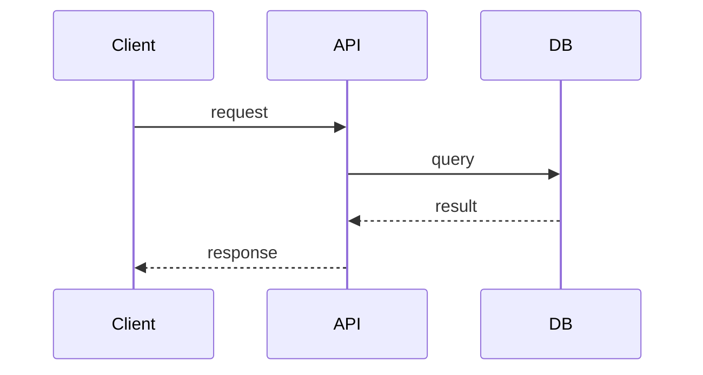

# RFC-NNN: <Title>

## Summary
One paragraph.

## Motivation
Why now? What problem? Linked PRD: `product/prds/active/<feature>/`.

## Detailed Design
The meat. Diagrams (Mermaid preferred), data models, API shapes, sequence diagrams.

## Alternatives
What else was considered? Why not?

## Impact
- Performance:
- Security:
- Cost:
- SLO impact (`observability/slos.md`):

## Open Questions
-

## Rollout
- [ ] Feature flag
- [ ] Migration plan
- [ ] Rollback plan
