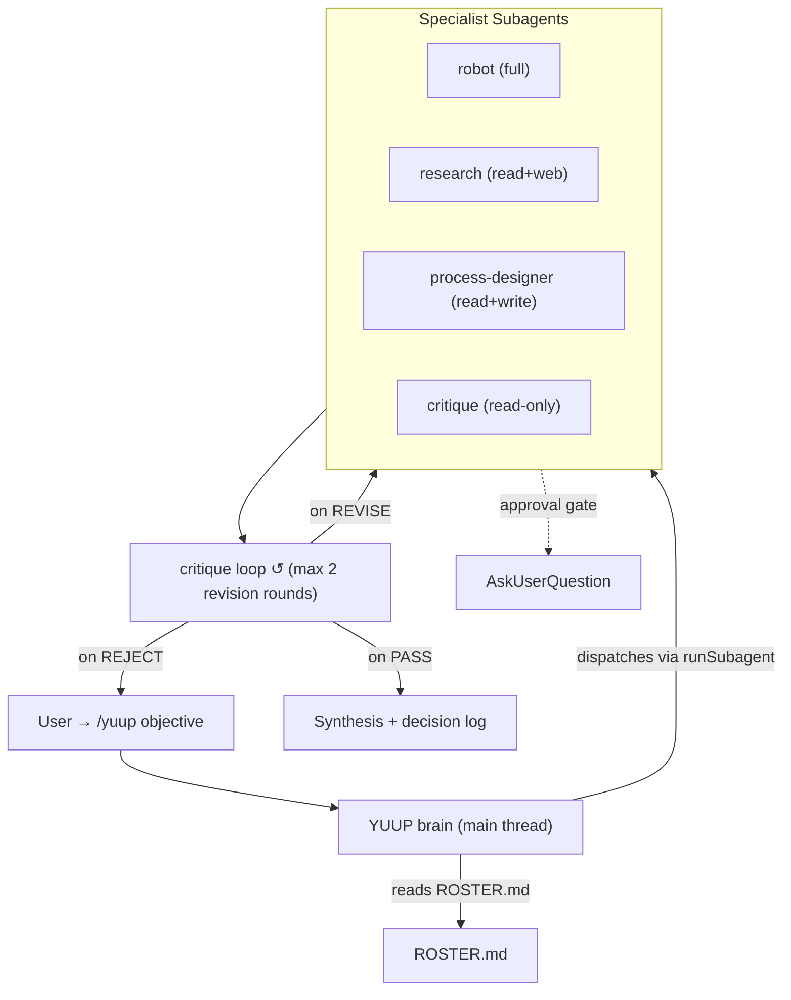

# Agent Orchestration Directive

> Layer 1 governance directive for YUUP (`/yuup`), the autonomous agent orchestrator.
YUUP is Layer 2 orchestration that plans, dispatches, critiques, gates, and synthesizes
using the runnable subagents in `.claude/agents/`.

## Architecture



## Runtime Layer vs. Persona Layer
- **`.claude/agents/`** — runnable subagents (Claude Code format, dispatched via `runSubagent`).
  These are the specialists YUUP commands: `robot`, `research`, `process-designer`, `critique`.
- **`agents/`** — persona specs (GitHub-Copilot `applyTo:` format) for the external
  "PRD Partner" app. These are NOT runnable subagents. YUUP references them for domain
  conventions only (see Bridge section below).

## Dispatch Rules
1. **Fan-out only from `/yuup`** — dispatched subagents cannot fan out further. The
   main thread is the only place parallel dispatch is permitted.
2. **Parallel** when tasks are independent (e.g., `research` + `process-designer` on
   different sub-tasks).
3. **Sequential** when one task depends on another's output.
4. **Critique after every specialist** — route the deliverable through `critique` before
   incorporating it into synthesis.
5. **Cap critique rounds** — maximum 2 `REVISE` re-dispatch cycles per task. After that,
   surface remaining blockers but proceed with a caveat.

## Approval Gates
YUUP reuses `approval-gates.md` verbatim. Before any action matching:
- Cost > \$1
- Destructive op (delete, force-push, drop, rm -rf)
- External communication (Slack post, email, Jira create, GitHub PR comment)
- Batch > 10 items
- Security / credential change
- Schema migration

…YUUP MUST stop and `AskUserQuestion`. One gate per question — no bundling.

## Error Handling
YUUP reuses `error-classification.md`:
- **Recoverable** (network, rate limit) → retry max 3, exponential backoff
- **User Input Required** → `AskUserQuestion`, do not guess
- **Fatal** → stop, log to `governance/.tmp/logs/error_log.jsonl`, surface to user

## Logging & Run Trace

Every YUUP run:
1. **Structured run trace** → `governance/runs/<run-id>.jsonl` — one JSON line per dispatch, result, gate, or budget event. Committed to the repo (not gitignored), human-readable, machine-parseable.
2. **Decision log** → `governance/.tmp/logs/` — summary log using the existing convention.

Run trace schema:
```json
{"type":"dispatch","run_id":"<id>","task":"<name>","agent":"<name>","objective_hash":"<sha256>","timestamp":"<ISO>"}
{"type":"result","run_id":"<id>","task":"<name>","agent":"<name>","verdict":"PASS|REVISE|REJECT","score":<0-100>,"tokens":<count>,"latency_ms":<ms>,"files_touched":["<path>"]}
{"type":"gate","run_id":"<id>","gate":"<name>","action":"<desc>","approved":true|false,"timestamp":"<ISO>"}
{"type":"budget_breach","run_id":"<id>","cap":"<name>","current":"<value>","timestamp":"<ISO>"}
```

## Blackboard Workspace (Phase 2)

Each run gets a dedicated workspace: `pipeline/active/<run-id>/`. Agents read and write artifacts there and pass **file references**, not giant prompt blobs. This:
- Reduces token cost (refs instead of inline content)
- Enables resume (re-running an objective picks up existing artifacts)
- Makes the run trace trivial to reconstruct (all artifacts in one place)

**Convention:** An agent writes its output to `<run-id>/<task-name>.md` (or `.json`), then returns the path in its envelope's `files_touched`.

## Deterministic Offloading (Phase 2)

Move mechanical, non-judgmental steps out of agents and into Layer 3 scripts under `scripts/`. Agents invoke scripts rather than reproducing logic by judgment:

| Step | Script | Invoked By |
|------|--------|------------|
| Markdown lint | `scripts/lint-markdown.sh <file>` | any agent |
| Link validation | `scripts/validate-prd-links.py <file>` | `critique`, `robot` |
| Frontmatter validation | `scripts/validate-frontmatter.py <dir>` | `robot` |
| Run trace append | `scripts/append-run-trace.py <run-id> <json>` | YUUP orchestrator |

**Why:** Your framework says push 90% of steps into deterministic code. A 90%/step accuracy compounds to 59% over 5 judgment steps. Each offloaded step replaces a judgment point.

## Bridge to Existing 11 Persona Agents
When an objective falls in a persona agent's domain, YUUP uses that agent's conventions
(e.g., `prd-creation.agent.md` for PRD structure) but performs the actual work through
its runnable specialists. The bridge table is in `.claude/agents/ROSTER.md`.

## Anti-Patterns
- Dispatching YUUP as a subagent (fan-out won't work)
- Bundling multiple approval gates into one question
- Skipping the critique loop
- Adding a specialist without registering it in `ROSTER.md`
- Proceeding past a `REJECT` verdict without surfacing to the user

## Future Options
- **Built-in "Agents Orchestrator" subagent** — available in the subagent registry; may be
  useful for pipeline-style work but cannot fan out (same constraint).
- **`ruflo` swarm MCP** — multi-agent MCP for swarm-style coordination. Noted as an
  optional escalation path; the core build uses native Claude Code subagents for reliability.
- **Scheduled/unattended runs** — hook noted for a later pass (not in this scope).
